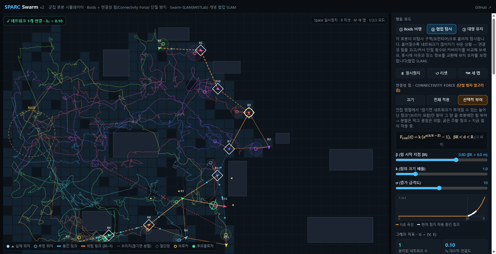
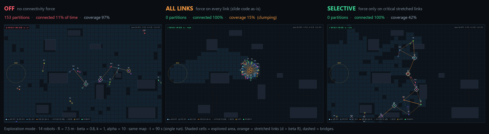

# SPARC Swarm

**A browser-based swarm-robot simulator that keeps the robot network from falling apart, using a *connectivity force* on top of Boids, plus decentralized collaborative SLAM inspired by Swarm-SLAM.**

[](https://kraewon7422.github.io/swarm-sim/)




**▶ [Open the live demo](https://kraewon7422.github.io/swarm-sim/)**: no install, works on desktop and mobile. The in-app UI is in Korean; a Korean summary follows.

## 한국어 요약

군집 로봇이 넓게 흩어지면 통신 반경 R을 벗어나 네트워크가 여러 조각으로 끊어집니다(Network Partitioning). 이 시뮬레이터는

- Boids 속도 업데이트에 **연결성 힘** F = k(e<sup>α(d/R−β)</sup> − 1) (βR < d < R)을 더해 링크가 끊어지기 전에 끌어당기고,
- 모든 링크에 힘을 주면 군집이 한 곳에 뭉치는 문제를 피하려고, 인접 행렬에서 **"끊기면 네트워크가 쪼개질 수 있는 늘어난 링크"에만 힘을 선택적으로 부여**하며,
- 라플라시안 **L = D − A의 고유값**(0의 개수 = 분리된 네트워크 수, λ₂ = 대수적 연결도), 브리지·절단점을 매 순간 계산해 보여줍니다.
- 추가로 Swarm-SLAM(MISTLab) 개념의 탈중앙 협업 SLAM(희소 디스크립터 교환, 로봇 간 루프클로저, 브로커)을 함께 시뮬레이션합니다.

화면의 **연결성 힘: 끄기 / 전체 적용 / 선택적 부여** 버튼으로 세 가지를 바로 비교할 수 있습니다.

---

## The problem

Each robot can only talk to neighbours within communication radius **R**, so the swarm is a graph **G = (V, E)**: robots are vertices and radio links are edges. As robots spread out to explore, links stretch past R and the graph splits into isolated groups. Those groups can no longer share maps, positions or findings, and they end up searching the same places twice.

## The algorithm: connectivity force

The robots use Boids-style local rules, with one extra term:

```
velocity += alignment + cohesion + separation + F_con
```

$$
F_{\text{con}}(d) =
\begin{cases}
0, & d \le \beta R \\
k\left(e^{\alpha (d/R - \beta)} - 1\right), & \beta R < d < R
\end{cases}
$$

- **β = 0.8**: the force switches on at 80 % of the radio range. It starts at exactly 0 at d = βR and grows exponentially as the link approaches R.
- **k** scales the magnitude and **α** sets how steeply it rises. The defaults are k = 1 and α = 10, and all three are adjustable with sliders. In simulator units, F = 1 corresponds to an acceleration of 7.5 m/s².
- The force pulls robot *i* toward robot *j* along their link. Both endpoints feel it.

### Which links get the force?

| Mode | Rule | What happens |
|---|---|---|
| **Off** | no connectivity force | robots spread freely and the network shatters |
| **All links** | every link with `A[i][j] = 1` | the network never splits, but the whole swarm contracts into a ball and stops exploring |
| **Selective** | only **critical stretched links** | the network stays connected *and* the swarm keeps spreading out |

**Selective rule.** Split the adjacency matrix into *safe* links (d ≤ βR) and *stretched* links (βR < d < R). A stretched link is **critical** when its two endpoints are **not** connected through safe links alone, meaning the network could split if the stretched links snapped. Critical links are found with union-find over the safe links in near-linear time. Every stretched **bridge** is critical. Unlike bridge-only protection, the rule also catches two parallel stretched links snapping at the same moment. At the same force strength, protecting only bridges still allowed 6–9 partitions per two minutes; this rule allowed 0 (see the table below).

```text
A      ← adjacency(positions, R)                 # 1) adjacency matrix
L      ← D − A ;  λ ← eig(L)                      # #zeros = #networks, λ₂ > 0 ⇔ connected
A_safe ← { (i,j) : A[i][j] = 1, d ≤ βR }
C      ← { (i,j) : A[i][j] = 1, d > βR,
           i and j not connected in A_safe }     # links whose loss could split the network
for each (i, j) with A[i][j] = 1:
    if mode == ALL or (i, j) ∈ C:
        if βR < d < R:                            # 2) connectivity force
            F   ← k · (exp(α · (d/R − β)) − 1)
            v_i += F · (x_j − x_i) / d
v_i += alignment + cohesion + separation
```

### Results



Exploration mode, 14 robots, R = 7.5 m, β = 0.8, k = 1, α = 10. Each cell shows the range over **3 runs of 120 simulated seconds**:

| Connectivity force | Partition events | Time fully connected | Area explored | Swarm radius |
|---|---|---|---|---|
| Off | 131 – 223 | 10 – 48 % | 92 – 99 % | 5.5 – 13 m |
| All links | **0** | **100 %** | 12 – 17 % | 3.0 – 3.2 m |
| **Selective** | **0** | **100 %** | **55 – 72 %** | 9 – 10 m |
| *Bridges only (comparison)* | 6 – 9 | 11 – 95 % | 86 – 89 % | — |

The *bridges-only* row comes from a separate batch of 3 runs; in that batch, the Selective rule again scored 0 partitions and 100 % connectivity. Protecting only bridges explores more, but it doesn't keep the network whole.

In Boids flocking mode, the same test gives 2–8 partitions with the force off and 0 with either All links or Selective. Flocking already keeps the swarm compact, so the clumping trade-off shows up mainly in exploration mode.

## Graph theory, live

The right-hand panel recomputes the network's algebra every frame:

- The **adjacency matrix A** is drawn as a live heat-map, with bridges in orange and cut vertices on the diagonal.
- The **Laplacian L = D − A** eigenvalues are computed with the cyclic Jacobi method. The number of **zero eigenvalues equals the number of separated networks**. This was checked against a BFS component count on 180 samples with up to 12 components, and all 180 matched.
- **λ₂, the algebraic connectivity** (Fiedler value), is > 0 exactly when the network is connected.
- **Bridges** and **cut vertices** are found with Tarjan's DFS.
- The panel also shows average degree 2|E|/|V|, a partition-event counter, the fraction of time the network was fully connected, and the swarm radius.
- On the map, orange marks stretched links, dashed lines are bridges and ◇ marks cut vertices. The **F(d) curve** plots every link currently under force.

## Collaborative SLAM (SPARC)

**SPARC** stands for *Sparse Peer-Assisted Rendezvous & Correction*. It runs in every mode and is the focus of mode ②. Each robot has no GPS and no server:

1. **Odometry drift.** Heading error follows a gyro-like Ornstein–Uhlenbeck process, so the estimated position drifts. The variance σ² grows with distance travelled.
2. **Keyframes.** On entering a new place, a robot stores {estimated pose, σ, place descriptor}.
3. **Sparse exchange.** Neighbours within R swap only descriptors the other hasn't seen yet: 256 B each, versus about 48 KB for a full keyframe. The live counter shows about 98 % less traffic than sharing full maps.
4. **Loop-closure candidates** come from matching descriptors.
5. **Broker.** In each connected group, the robot with the lowest ID verifies at most K candidates per second, starting with those expected to reduce uncertainty the most. Look-alike places (perceptual aliasing) are rejected at this step.
6. **Fusion.** Poses are merged by inverse-variance weighting, with a floor on the fused variance so repeated closures can't double-count shared information. Trajectories are corrected linearly from the last anchor.
7. **Rendezvous.** When σ exceeds τ, a robot follows its most certain neighbour or returns to its last meeting point or the base.

*Borrowed from [Swarm-SLAM](https://github.com/MISTLab/Swarm-SLAM):* sparse descriptor exchange, inter-robot loop closures, a per-component broker and budgeted candidate prioritization. *Added here:* uncertainty-triggered rendezvous, frontier dispersion over shared coverage, and integration with the flocking and formation modes. *Simplified:* the world is 2-D, place recognition is modelled as grid-cell descriptors with an aliasing rate, and the paper's algebraic-connectivity candidate selection and distributed pose-graph optimization are approximated as described above.

## Modes & controls

| | |
|---|---|
| **① Boids flocking** | separation, alignment and cohesion among neighbours within R; click to set a goal |
| **② Exploration** *(default)* | frontier exploration plus collaborative SLAM; best for comparing connectivity modes |
| **③ Formation** | ring formation driven by estimated positions; click to move its centre |
| Keys | `Space` pause · `R` reset · `M` new map · `1` `2` `3` switch mode |
| Sliders | β, k, α · robots (3–40) · R · speed · separation / alignment / cohesion · odometry noise · τ · broker budget K · aliasing rate · sim speed ×1–6 |

## Run locally

There is no build step and nothing to install:

```bash
git clone https://github.com/kraewon7422/swarm-sim.git
cd swarm-sim
# open index.html in any modern browser, or serve the folder:
python -m http.server 8000      # → http://localhost:8000
```

## Reproduce the numbers

All simulation state is global, so you can run fast headless experiments from the browser's developer console:

```js
running = false;                    // stop the render loop from stepping
setMode('sparc'); setConn('sel');   // connectivity: 'off' | 'all' | 'sel'
reset(false);
for (let i = 0; i < 60 * 120; i++) step(DT);   // 120 simulated seconds at 60 Hz
({ partitions: st.partitions,
   connected: st.connT / time,
   explored:  st.vis / freeCount });
```

## Project structure

```text
index.html       v2: the whole simulator (HTML + CSS + JS in one file, ~1,150 lines)
index.v1.html    v1: first version (collaborative SLAM, Boids, formation)
screenshot.png   README images
comparison.png
```

| Version | Changes |
|---|---|
| **v2** | connectivity force (Off / All / Selective), live Laplacian spectrum, λ₂, adjacency matrix, bridges and cut vertices, partition metrics; SLAM fixes (OU heading drift with a matching σ model, fused-variance floor, stale-keyframe rule) |
| **v1** | collaborative SLAM, Boids and formation modes. Known issue: repeated fusion made σ collapse (about 0.15 m while the true error was about 14 m); fixed in v2 |

## Limitations & future work

- Once a link exceeds R, F = 0, so reconnection is left to the other behaviours.
- Radio is modelled as a perfect disk: walls don't attenuate the signal, reception doesn't depend on heading, and there is no actuation delay. Obstacles can also stop a robot from following the pull.
- Selecting critical links by **λ₂ sensitivity** (Fiedler vector) instead of the safe-link rule.
- The SLAM layer is a 2-D abstraction, not a sensor-level implementation.

## References

- Connectivity-force model: forum talk *“그래프 이론 기반 군집 로봇 네트워크의 통신 붕괴 임계점 분석 및 단절 방지 라우팅”* (공학 x 수학 2조).
- P.-Y. Lajoie and G. Beltrame, “Swarm-SLAM: Sparse Decentralized Collaborative Simultaneous Localization and Mapping Framework for Multi-Robot Systems,” *IEEE Robotics and Automation Letters*, 9(1), 475–482, 2024. [doi:10.1109/LRA.2023.3333742](https://doi.org/10.1109/LRA.2023.3333742) · [MISTLab/Swarm-SLAM](https://github.com/MISTLab/Swarm-SLAM)
- C. W. Reynolds, “Flocks, Herds, and Schools: A Distributed Behavioral Model,” *SIGGRAPH* 1987.
- M. Fiedler, “Algebraic connectivity of graphs,” *Czechoslovak Mathematical Journal*, 23(2), 298–305, 1973.
- R. E. Tarjan, “Depth-first search and linear graph algorithms,” *SIAM Journal on Computing*, 1(2), 146–160, 1972.

*This is an independent educational simulation. It is not affiliated with MISTLab or the Swarm-SLAM authors.*
